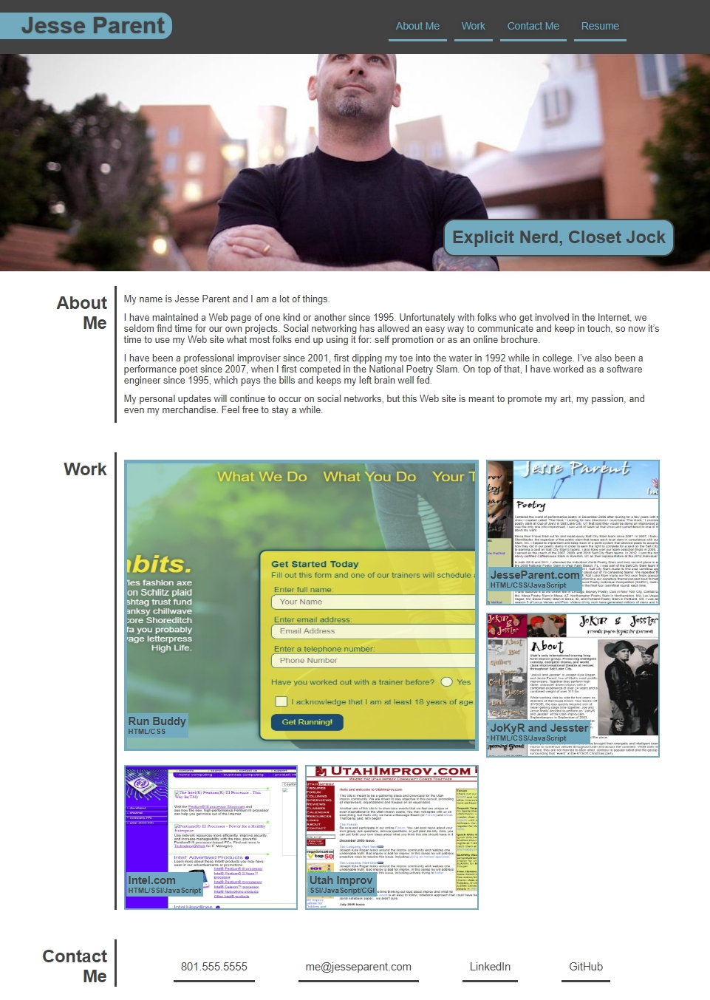

# Creation of Portfolio Web site
## Table of Contents
- [Summary](#summary)
- [HTML Approach](#html-approach)
- [CSS Technologies](#css-technologies)
- [Javascript](#javascript)
- [Deployed Application](#deployed-application)
- [Screenshot](#screenshot)

## Summary
In this project, a portfolio page was created using a [image mock-up](https://courses.bootcampspot.com/courses/455/files/157176) as the proposed layout. This is a developing portfolio to showcase my skills through examples of work I have done.

## HTML Approach
- Viewport meta tag
- Header with navigation to different sections
- Links to email using mailto, email address, subject, and body
- Links to telephone number that will place a call
- Recent photo as hero section
- Appropriate section comments

## CSS Technologies
- Used CSS variables for primary and secondary colors
- Flexbox used for layouts in one direction
- CSS Grid used for Work portfolio section
- Media queries used to appropriately alter elements at different resolutions
- View width (vw) used for most font sizes and width to be more reactive

## Javascript
- OnClick events used in Work section to open deployed projects in new window/tab

## Deployed Application
- The web page can be found at [https://jesseparent.github.io/portfolio/](https://jesseparent.github.io/portfolio/)

## Screenshot
- The screenshot of the final work: 
